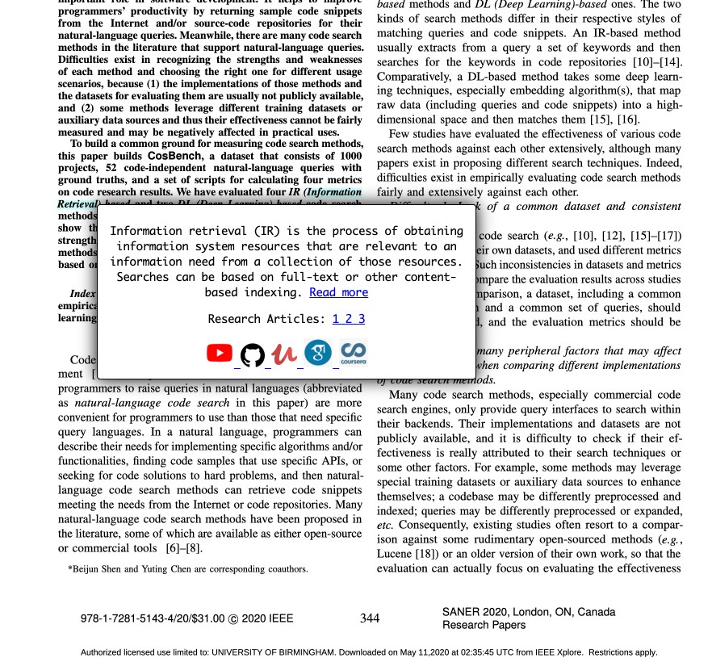

 # Research Buddy 

Are you someone who frequently reads or writes research papers/articles on the web? Do you get exhausted while searching for the citations? Moving back and forth between the pages and the citation section, and then searching for those papers with the DOI. Or while reading a paper you come across some terminology that you don't know about and start Googling to understand what is being talked about! Too much of work right?!

I'm sure you've come across this situation at some point! Research Buddy is here to make your life simple.

Double clicking on any text will give you a popup displaying the definition picked up from Wikipedia, the top 5 Paper citations, youtube links, google scholar links, and github links. You can highlight any term, and this tool will provide you the Wikipedia definition with a link to the page, and links pointing to the top 5 related papers as well as the search results from Youtube, Github, Udemy, Google Scholar and Coursera. You get everything in the bubble popup as seen below!

## Installation

 - Clone the repository: 
 ` git clone https://github.com/usmanwardag/research_buddy`
 - Go to `chrome://extensions/`
 - Turn on your developer mode
 - Click on Load Unpacked
 - Select your directory where you have cloned the repo
 - You should be able to see our extension loaded in your Google Chrome!

## CODE Documentation

You can find our Code documentaion for each method implemented over [here](https://github.com/usmanwardag/research_buddy/blob/main/out/index.html)

## How to Contribute?
  
 We would be happy to receive contributions! If you'd like to, please go through our [CONTRIBUTING.md](https://github.com/usmanwardag/research_buddy/blob/main/CONTRIBUTING.md)
 
 ## Future Steps 
  - Implement this tool for PDFs.
  - Show abstract of cited papers in the popup.
  - If a reader highlights a citation, all other instances of the same citation should be highlighted inside a research paper PDF.
  - Improve features and make the tool more user friendly.
  
 ## Contact

* [Kriti Khullar](https://github.com/kriti0207)
* [Muskan Gupta](https://github.com/muskan7828)
* [Suneha Bose](https://github.com/sbosenc)
* [Urvashi Kar](https://github.com/Urvashi74)
* [Usman Mahmood Khan](https://github.com/usmanwardag)

 
